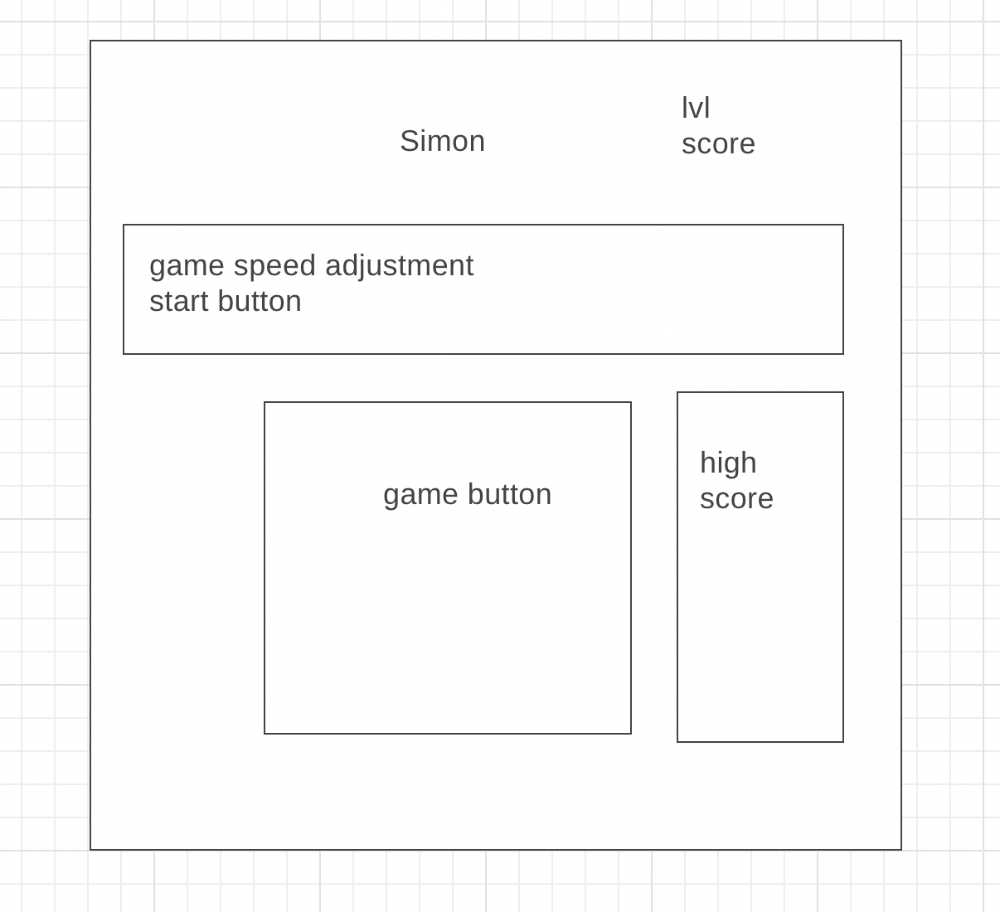

# SIMON

A be loved 80's game.

Players must repeat random sequences of lights by pressing the colored pads in the correct order.
It is a fast-paced game that will require your concentration and short term memory.
Challenge your friends and beat your own high score.

## Technologies Used:

- JavaScript
- CSS
- HTML

## Start the game

Give it a try, just click the link below, adjust your begining speed and click START!
[SIMON Ver 1.0](https://takwailo.github.io/Simon-game/)

## Wireframe

## Future Enhancements

- audio
- visual improvements
- mobile verision
- make your own sequence
